CMSC 100 U1L  
Audije, Aubrey  
Banzon, Trixia Mae  
Lim, Charmaine  
Vargas, Patricia Mae  

FieldFare is an e-commerce website that we created to be used by the Department of Agriculture to facilitate transactions between farmers and customers.    
  
Project features:  

    1. Login  
    Landing page   
      
    2. Signup  
    Users can create an account  
      
    3. Admin  
        a. Home - It has a dashboard that shows the number of Order Requests, Total Accounts, Income from the sold products.  
        b. Catalog - Admin can add products, and edit and delete the added products. Admin can sort the products by name, price, quantity and type in ascending or descending order. Admin can search product name as well.  
        c. Accounts - Admin can see the list of registered customer accounts. Admin can also search an account.
        d. Orders - This is where the order request will go after the customer confirms their order. Admin can either approve or decline the order. 
        e. Sales - Admin can see the summary of transactions weekly, monthly, and annually. It displays the summary of a product, quantity sold, and sales income of the product. It displays the total sales for all transactions as well. 
          
    5. Customer  
        a. Home - It displays the background of the website. It sets the vibe on what will come next as the customer navigates the site. It has a button to check the store as well.   
        b. Store - Customer can see the added products from the Admin side. They can sort the products by name, price, type, and quantity. It also has a shopping cart. Customers can choose which product to add into their cart, and it will be automatically displayed in the shopping cart. Customer will then checkout the contents of the cart.  
        c. Customer Checkout Page - This will appear once the customer clicks the checkout button. In this, summary of the customer orders is displayed. Customers will confirm their orders here. Once the customer confirms their order, a request will be sent to the Admin side in which Admin can either approve or decline the customer order.  
        d. Orders - After sending a request, this page will automatically appear. Pending orders, completed orders, and cancelled orders are displayed here. Customers can cancel their pending orders.  
        e. Customer Profile - Customers can edit their first name, middle name, last name, and email. Customers can also see their transaction history such as products purchased.  
          
How to run:    
    1. Clone the project to your local repository   
    2. Go to the directory of the project and open two terminals, one for backend and one for frontend. Go to the directory of backend and frontend.        
    3. Type 'npm install' in both terminal    
    4. Go to the backend terminal, type 'node index.js'    
    5. Go to the frontend terminal, type 'npm run dev'    
    6. Open the link and use the website  
       

  
 
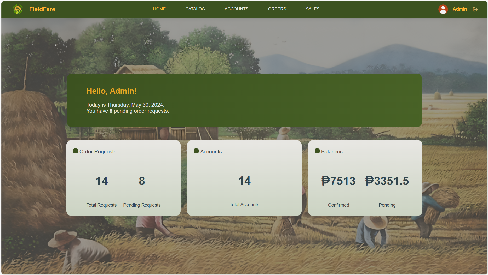  
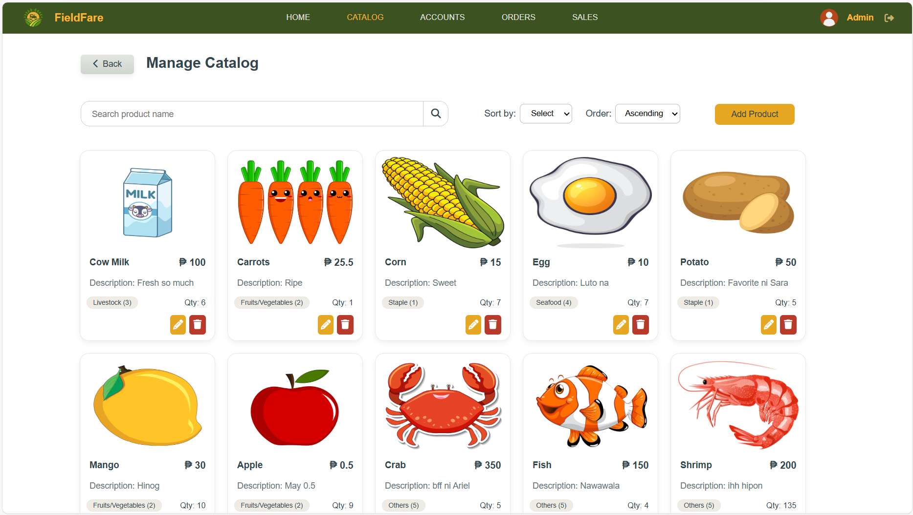  
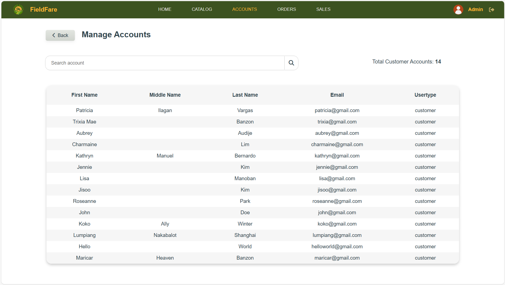  
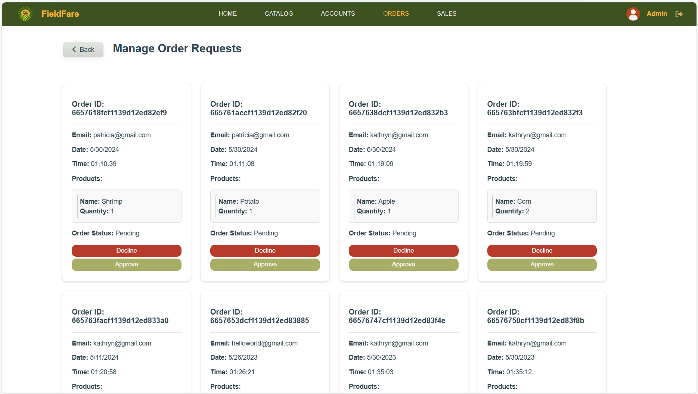  
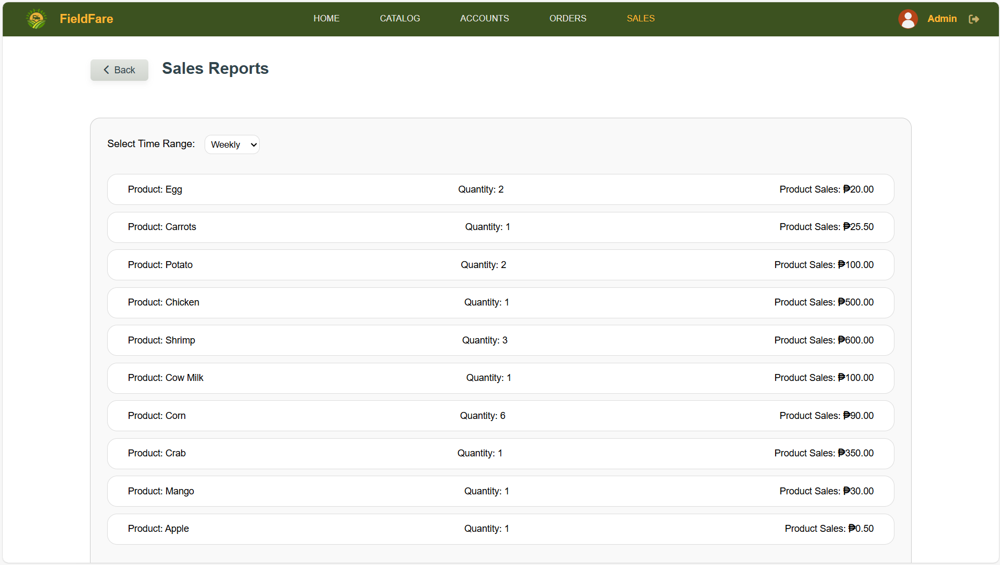  

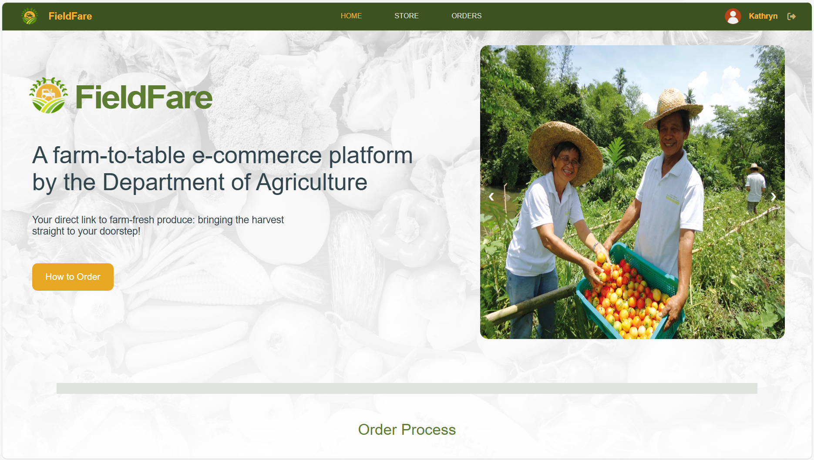  
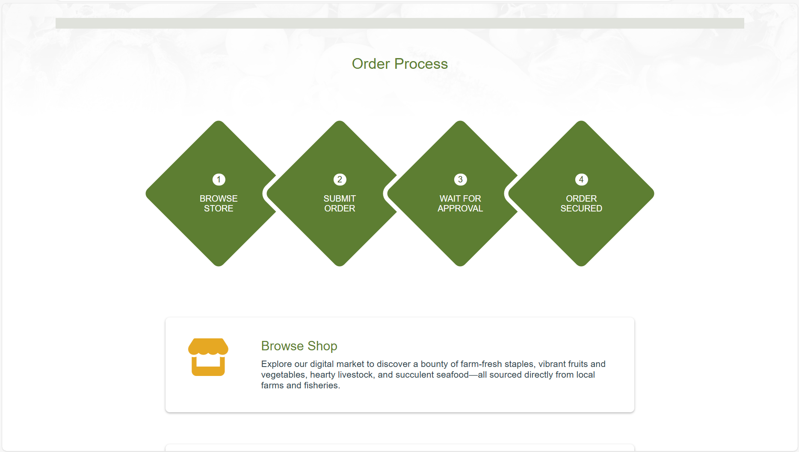  
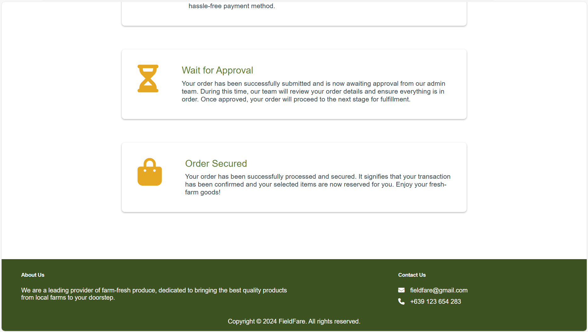  
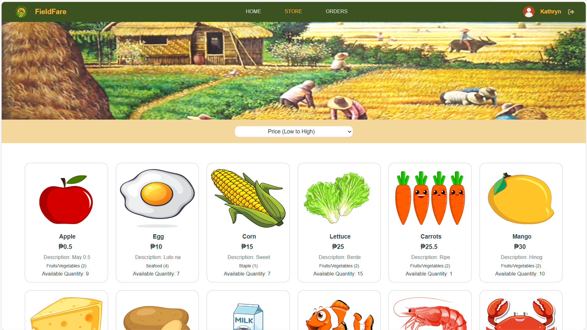  
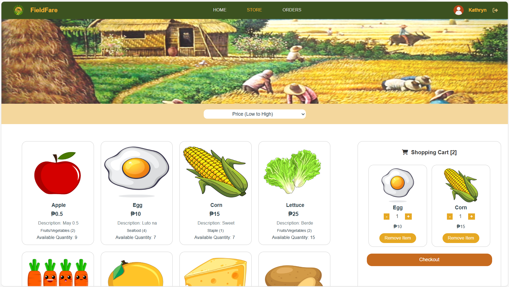  
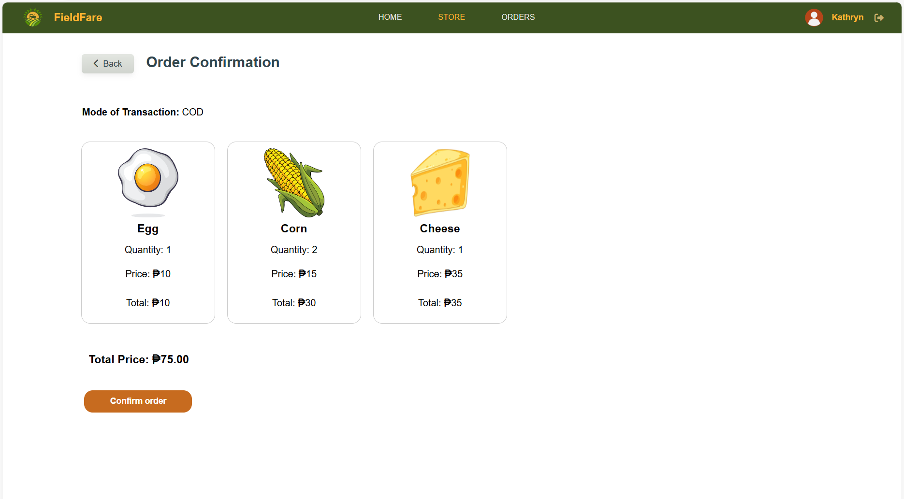  
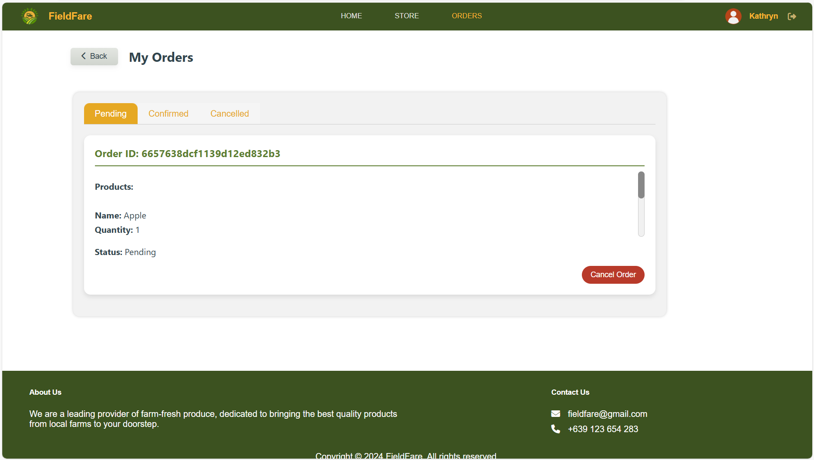  
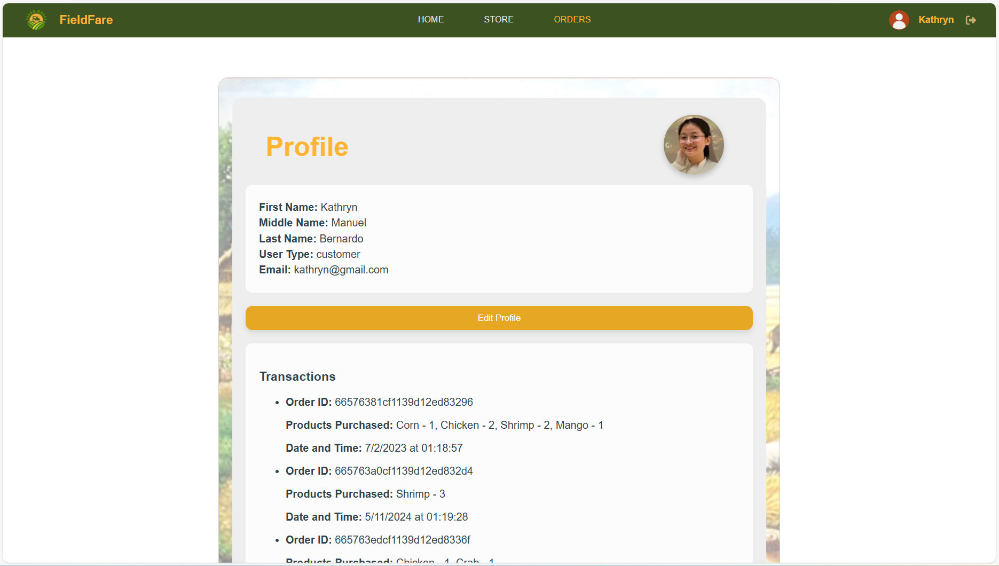  

